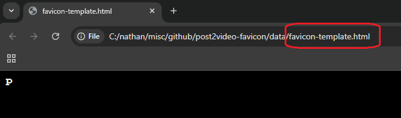
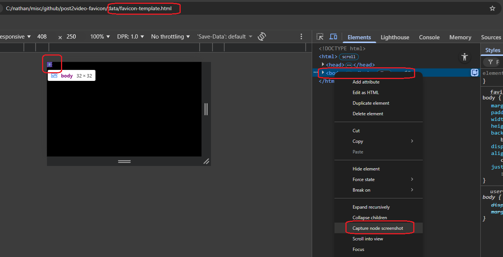
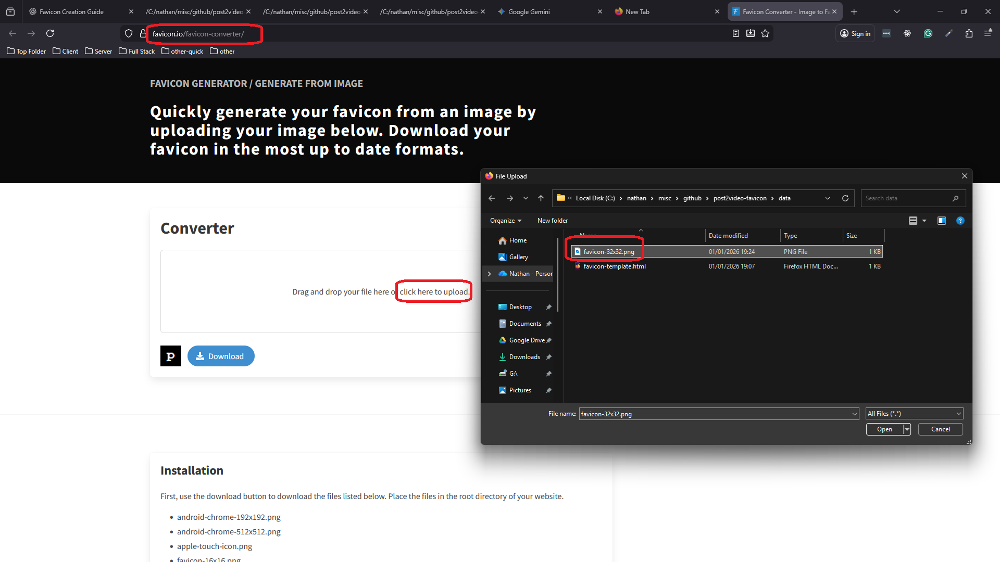
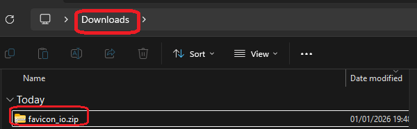
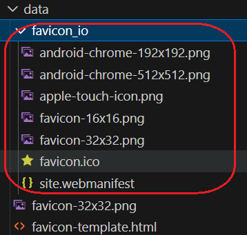
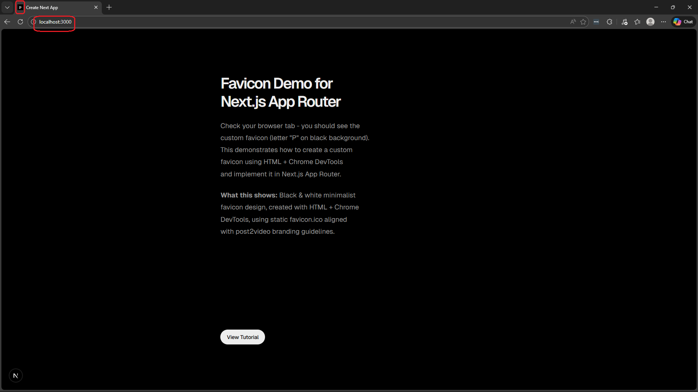

<h1>Project Name</h1>
Add a Favicon to Next.js SaaS tool - My Experience

<p>My experience adding a custom favicon to post2video (Next.js SaaS app). Documents the process of creating a B&W minimalist favicon using HTML + Chrome DevTools, why AI generation failed, and implementing it in Next.js App Router. Includes working example and step-by-step screenshots.</p>

<h2>Motivation</h2>
  <p>I needed a custom favicon for my SaaS application, post2video, that matches its black & white minimalist branding.</p>

  <p><strong>Questions explored:</strong></p>
  <ul>
    <li>Why favicon matters for SaaS apps</li>
    <li>How to create favicon for Next.js App Router</li>
    <li>Static vs dynamic: what to choose</li>
    <li>Aligning favicon with post2video's B&W branding</li>
  </ul>

  <p>All answered in this project.</p>

<h2>Key Takeaways</h2>
<ul>
  <li><strong>AI image generation fails for exact dimensions:</strong> Tried ChatGPT first but couldn't get consistent 32x32px output - HTML + Chrome DevTools gives precise control for favicon creation</li>

   <li><strong>Next.js App Router makes favicon serving trivial:</strong> Just place <code>favicon.ico</code> in the <code>app/</code> directory - no imports, no configuration, automatic detection</li>

</ul>

<h2>Concepts</h2>

  <h3>What is a Favicon?</h3>
  A favicon is a small icon that represents a website, appearing in browser tabs, bookmarks, and search results.

  <h3>Why Favicons Matter</h3>
  <ul>
      <li><strong>Brand recognition in search results</strong> - Favicon displays next to your URL in Google search results (desktop), making your listing more recognizable</li>
      <li><strong>Trust and professionalism</strong> - Sites without favicons show default browser icons (blank page/globe), signaling amateur or sketchy sites</li>
      <li><strong>Better user experience</strong> - Appears in browser tabs, bookmarks, history, and iOS/Android home screen shortcuts</li>
  </ul>

<strong>Note:</strong> Favicons don't improve your Google search ranking, but they do improve brand recognition and trust in search results.

<h3>Why Multiple Icon Sizes?</h3>
  <ul>
    <li><strong>Browser tab vs Phone app icon:</strong>
      <ul>
        <li><strong>Browser tabs:</strong> 16x16 or 32x32 favicon.ico (works everywhere - desktop, iPhone, Android)</li>
        <li><strong>iPhone "Add to Home Screen":</strong> 180x180 apple-touch-icon (website icon on iPhone home screen next to Instagram, Gmail, etc.)</li>
        <li><strong>Android "Add to Home Screen":</strong> 192x192 icon (website icon on Android home screen)</li>
        <li><strong>Progressive Web Apps (PWAs):</strong> Multiple sizes (192x192, 512x512) for installable apps on both iPhone and Android</li>
      </ul>
    </li>
    <li><strong>Post2video only needs favicon.ico:</strong>
      <ul>
        <li>Browser-based web app - no Android/iPhone app, no PWA (users visit via URL on any device)</li>
        <li>No "Add to Home Screen" or installation feature</li>
      </ul>
    </li>
  </ul>

   <h3>Static vs Dynamic Favicons</h3>
  <ul>
    <li><strong>Static favicon (most common):</strong>
      <ul>
        <li>Fixed image file(s) created beforehand - can be one (just favicon.ico) or many (favicon.ico + apple-icon.png + icon-192.png for different sizes)</li>
        <li>Same icon for everyone, all the time</li>
        <li>Use when: Logo/branding doesn't change</li>
      </ul>
    </li>
    <li><strong>Dynamic favicon (advanced use cases):</strong>
      <ul>
        <li>Favicon changes based on user state or data</li>
        <li>Generated programmatically with code (icon.tsx using ImageResponse API)</li>
        <li>Use when:
          <ul>
            <li>Showing unread counts (Gmail shows "(3)" in favicon for 3 unread emails)</li>
            <li>Status indicators (Slack shows green dot when online, gray when away)</li>
            <li>User personalization (show user's initials or avatar in tab)</li>
            <li>Multi-tenant SaaS (different logo per customer/organization)</li>
          </ul>
        </li>
      </ul>
    </li>
    <li><strong>Why post2video uses static:</strong>
      <ul>
        <li>Logo is fixed branding - doesn't change</li>
        <li>No user state to display in favicon (no unread counts, status, etc.)</li>
        <li>One brand for all users</li>
      </ul>
    </li>
  </ul>

<h2>Installation</h2>

 <p>To see the working example:</p>

```bash
pnpm install
```

<h2>Usage</h2>

 <h3>Run the Example App</h3>

```bash
pnpm dev
```

  <p>Open http://localhost:3000 and check the browser tab for the favicon.</p>

  <h3>Create Your Own Favicon</h3>

  <h4>Step 1: Create the Favicon with HTML + Chrome DevTools</h4>

  <p><strong>1.1 Create HTML file with your design</strong></p>

  <p>See <code>data/favicon-template.html</code> for the HTML template used to create the favicon.</p>

<h4>1.2 Screenshot with Chrome DevTools</h4>
  <ol>
    <li>Open <code>data/favicon-template.html</code> in Chrome (the HTML has a fixed 32x32px body)</li>
    <li>Open DevTools (F12 or right-click → Inspect)</li>
    <li>In the Elements tab, right-click on <code>&lt;body&gt;</code> tag</li>
    <li>Select "Capture node screenshot"</li>
    <li>Chrome saves a perfect 32x32px PNG file to your Downloads folder (see <code>data/favicon-template.png</code> for expected result)</li>
  </ol>

<h4>1.3 Convert PNG to ICO</h4>
  <p>I used <a href="https://favicon.io/favicon-converter/">favicon.io converter</a> - simple upload and download.</p>

  <h4>Step 2: Add to Next.js App Router</h4>

  <p>Place <code>favicon.ico</code> in the <code>app/</code> directory. Next.js automatically detects and serves it - no configuration needed.</p>

<h2>Technologies Used</h2>
  <ul>
    <li>Next.js 15 (App Router)</li>
    <li>pnpm</li>
  </ul>

<h2>Design</h2>

<h3>Design Constraints</h3>
  <ul>
    <li><strong>Brand identity:</strong> Black & white minimalist aesthetic</li>
    <li><strong>Target audience:</strong> Developer-bloggers, technical creators</li>
    <li><strong>Solo developer priority:</strong> Simple, maintainable solutions</li>
  </ul>

<h3>Favicon Design Choices</h3>
  <p>Specific design choices for the favicon matching post2video branding:</p>
  <ul>
    <li>Black background, white text (matches website branding)</li>
    <li>Monospace font (Courier New) - technical/developer aesthetic</li>
    <li>Single letter "P" - simple, readable at 32x32px, easy to spot in browser tabs</li>
    <li>Text-only, no graphics - maintains B&W minimalist consistency</li>
    <li>Centered, generous whitespace - professional look</li>
  </ul>

<h3>Implementation Options</h3>
  <p>Creating and implementing a favicon involves two separate steps:</p>
 <h3>1. Creating the favicon image file (general - works for any website)</h3>

  <table>
    <tr>
      <th>Tool/Method</th>
      <th>Description</th>
      <th>Best For</th>
      <th>Post2Video Decision</th>
    </tr>
    <tr>
      <td>favicon.io website</td>
      <td>Online generator - upload image or generate from text/emoji</td>
      <td>Quick generation without design tools</td>
      <td>❌ Needed precise control for B&W minimalist design</td>
    </tr>
    <tr>
      <td>Design tools (Figma/Photoshop)</td>
      <td>Professional design software for custom graphics</td>
      <td>Custom branding, complex designs</td>
      <td>❌ Overkill for simple B&W text/logo</td>
    </tr>
    <tr>
      <td>AI image generation (ChatGPT, DALL-E, Midjourney)</td>
      <td>Generate favicon with AI using text prompts</td>
      <td>Quick custom designs - but often fails to deliver exact dimensions (32x32)</td>
      <td>❌ Tried first - couldn't get exact 32x32px consistently</td>
    </tr>
        <tr>
      <td>HTML + Chrome DevTools</td>
      <td>Create HTML with styled content, screenshot with DevTools</td>
      <td>Programmatic/code-based icon creation</td>
      <td>✅ Chosen - exact control over B&W design and dimensions</td>
    </tr>

  </table>

<h3>2. Implementing the favicon in Next.js App Router (Next.js specific)</h3>

  <table>
    <tr>
      <th>File Location</th>
      <th>Description</th>
      <th>When to Use</th>
      <th>Post2Video Decision</th>
    </tr>
    <tr>
      <td><code>app/icon.png</code><br/><code>app/apple-icon.png</code></td>
      <td>Static PNG files (32x32 or 180x180 for Apple)</td>
      <td>Better image quality than .ico</td>
      <td>❌ No quality advantage for simple B&W design</td>
    </tr>
    <tr>
      <td><code>app/icon.tsx</code></td>
      <td>Dynamic icon using ImageResponse API</td>
      <td>Programmatically generated icons, dynamic content</td>
      <td>❌ Logo is fixed, not dynamic</td>
    </tr>
    <tr>
      <td><code>app/layout.tsx</code></td>
      <td>Metadata API with icons object</td>
      <td>Multiple icon sizes, full control over metadata</td>
      <td>❌ Only need one simple favicon, not multiple sizes</td>
    </tr>
        <tr>
      <td><code>app/favicon.ico</code></td>
      <td>Static .ico file in app directory</td>
      <td>Simplest option, maximum browser compatibility</td>
      <td>✅ Chosen - perfect for fixed B&W logo</td>
    </tr>

  </table>

<h2>Code Structure</h2>

<h3>Favicon Template HTML</h3>

  <p>The core of the favicon creation - <code>data/favicon-template.html</code>:</p>

```html
<!DOCTYPE html>
<html>
  <head>
    <style>
      body {
        margin: 0;
        padding: 0;
        width: 32px;
        height: 32px;
        background: black;
        display: flex;
        align-items: center;
        justify-content: center;
        overflow: hidden;
      }
      .icon {
        font-family: "Courier New", monospace;
        font-size: 20px;
        font-weight: bold;
        color: white;
        line-height: 1;
        margin-top: -2px;
      }
    </style>
  </head>
  <body>
    <div class="icon">p</div>
  </body>
</html>
```

<h2>Demo</h2>

  <p>Open in browser</p>
  

  <p>Capture node screenshot</p>
  

  <p>Convert upload</p>
  

  <p>Now click download and you will get zip file</p>
  

  <p>Copied to data as favicon_io folder</p>
  

  <p>favicon.ico copied to app folder, now run pnpm dev</p>
  

<h2>Points of Interest</h2>
    <ul>
      <li><strong>Mobile browsers aggressively cache favicons:</strong> If you update your favicon and don't see changes on mobile, you need to clear browser cache/website data - a simple refresh won't work.</li>
    </ul>

<h2>References</h2>
    <ul>
      <li><a href="https://favicon.io/favicon-converter/">favicon.io Converter</a> - PNG to ICO conversion tool</li>
      <li><a href="https://nextjs.org/docs/app/api-reference/file-conventions/metadata/app-icons">Next.js Favicon Documentation</a> - Official Next.js icon conventions</li>
      <li><a href="https://www.post2video.com">post2video</a> - Live implementation of this favicon</li>
    </ul>
